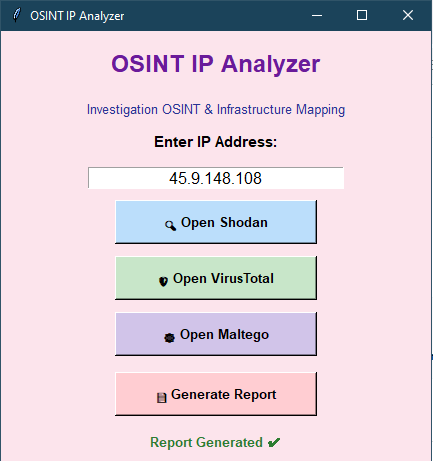

# 🔍 OSINT IP Analyzer

Un outil OSINT avec interface graphique (GUI) pour analyser les adresses IP باستخدام Python.

---

## 🧠 Description

Ce projet est une application Python avec interface graphique qui permet d’analyser une adresse IP facilement باستخدام:

* 🌐 Shodan
* 🛡️ VirusTotal
* 🧩 Maltego

L’application offre une interface simple et agréable pour faire des analyses OSINT rapidement.

---

## 🖼️ Interface (GUI)

Voici l’interface de l’application:



---

## 🚀 Comment exécuter le projet

### 1️⃣ Cloner le projet

```bash
git clone https://github.com/VOTRE_USERNAME/OSINT-IP-Analyzer.git
cd OSINT-IP-Analyzer
```

---

### 2️⃣ Installer les dépendances

```bash
pip install -r requirements.txt
```

---

### 3️⃣ Lancer le programme

```bash
python OSINT_IP_Analyzer.py
```

---

## ⚙️ Utilisation

1. Entrer une adresse IP
2. Cliquer sur un bouton:

   * 🔎 Open Shodan
   * 🛡️ Open VirusTotal
   * 🧠 Open Maltego
   * 📄 Generate Report

✔ Les résultats s’affichent dans l’interface
✔ Un rapport peut être généré

---

## 🎥 Vidéo de démonstration

👉 [📥 Télécharger la vidéo](Vidéo.rar)

---

## 📦 Requirements

* Python 3.x
* requests
* shodan
* vt-py

---

## 👨‍💻 Auteur

* mima-sudo

---

## ⚠️ Avertissement

Ce projet est uniquement à but éducatif.
